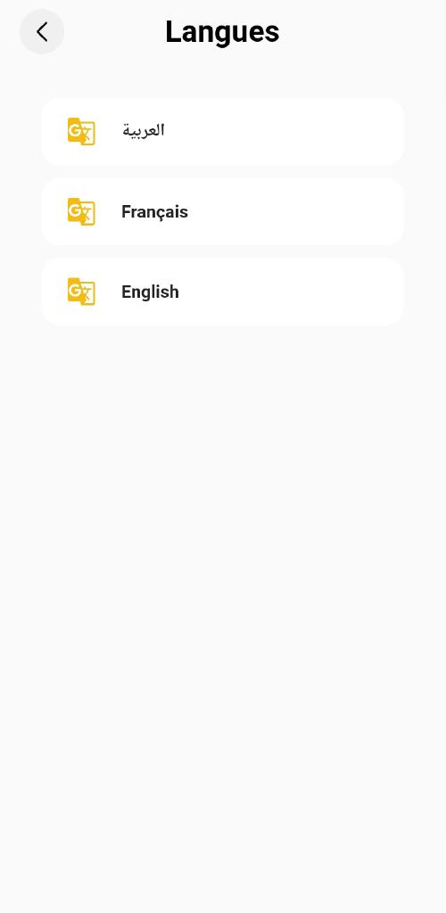

# Grocery-Store

Grocery-store is a comprehensive mobile application designed to provide a seamless grocery shopping experience for users. Developed using Flutter for both Android and iOS platforms, it offers three fully functional mobile apps: Grocery-store App (Consumer app), Delivery Boy (Driver) App, and grocery Dashboard App. 

Key Features:

1. Grocery-store App (Consumer app): The Grocery-store app serves as the primary platform for consumers to browse, search, and purchase groceries. It offers a modern and beautiful layout, ensuring an intuitive and visually appealing user experience. Users can easily navigate through various categories, view product details, add items to their cart, and proceed with secure online payments. The app supports multi-language functionality, allowing users to interact in their preferred language.

2. Delivery Boy (Driver) App: The Delivery Boy app is specifically designed for delivery personnel to efficiently manage grocery deliveries. It enables drivers to view assigned orders, optimize their routes, track delivery progress, and update the status of completed deliveries. This app streamlines the delivery process and ensures effective communication between drivers and customers.

3. Grocery Dashboard App: The Grocery Dashboard app serves as a management tool for grocery store owners. It provides a centralized platform to oversee and control various aspects of the grocery business. Store owners can manage product inventory, track orders, monitor delivery operations, and gain valuable insights into customer preferences and behavior. The dashboard app offers a comprehensive view of the business and enables efficient decision-making.

4. Integrated with Django Backend: The application is integrated with Django, a powerful backend framework. The Django backend handles the storage and management of all information related to the grocery store, including product details, customer orders, and delivery operations. The mobile apps interact with the Django API to fetch and update data in real-time.

5. Modern and Beautiful Layout: The application boasts a modern and visually appealing layout, ensuring a pleasant user experience. The user interface is designed to be intuitive, making it easy for customers to navigate through the app, explore products, and make purchases seamlessly.

6. Multi-language Support: The Grocery-store app supports multi-language functionality, allowing users to interact with the application in their preferred language. This feature enhances accessibility and ensures a user-friendly experience for a diverse user base.

Overall, the Grocery-store application offers a feature-rich solution for customers, delivery personnel, and grocery store owners. Its robust functionality, integration with Django backend, and visually appealing design make it an ideal choice for businesses in the grocery industry seeking to provide a convenient and efficient shopping experience to their customers.

Please note that as Grocery-Store is a customized application developed for a specific client, sharing the source code may not be feasible due to confidentiality and intellectual property reasons. However, the provided description outlines the key functionalities and features of the application.

grocery Dashboard application link https://github.com/chahedmoetaz/Shopoo
Delivery Boy (Driver) application link https://github.com/chahedmoetaz/Venven

## feel free to contact us : https://wa.me/21654120687 or chahedmoetaz@gmail.com

## Photos

